# ai-proj
<u>Building Sample projs to learn & understand Artificial Intelligence.</u>
---


### <u>Loss Functions</u>

<u>L1 Loss</u>
```
loss = sum(|y_real - y_predicted|)
```
<u>L2 Loss</u>
```
loss = sum((y_real - y_predicted)^2)
```
---

## <u>CCai - Cancer - AI model</u>

<u>Artificial Intelligence (AI)</u> is the spark of human ingenuity igniting machines to think, learn, and adapt. It’s where algorithms dance with data, mimicking our ability to reason and solve problems. In this project, I’ve harnessed a slice of AI’s magic, crafting a simple model that learns from patterns—just like a curious mind. Built with a follow-along video, it’s my first step into the vast, thrilling world of intelligent systems. Explore the code and witness AI’s potential unfold!

<u>Written with:</u> [https://colab.research.google.com/]()


This project looks at a simple and a real world use-case: 

 use of a cancer research dataset on diagonsed cancer tumors found in patients and train the ai model to categorise the dataset into malignant and benign tumours `m=1, b=0`. 
 The AI's prediction accuracy is also accessed too.


1. Upload the dataset used for the project. Downloaded from []() as zipped file, file unzipped & saved on local:
  ```
        import cancer.csv file.
  ```


2. Upload:

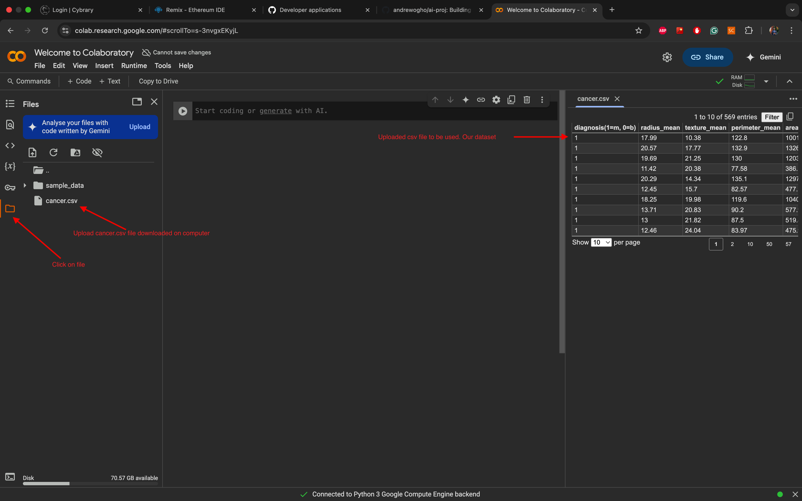  

3. Go to code in cell:
    ```
    import pandas as pd
    ```
   
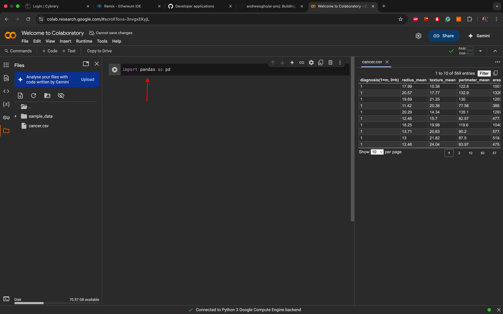


4. Add x-axis:

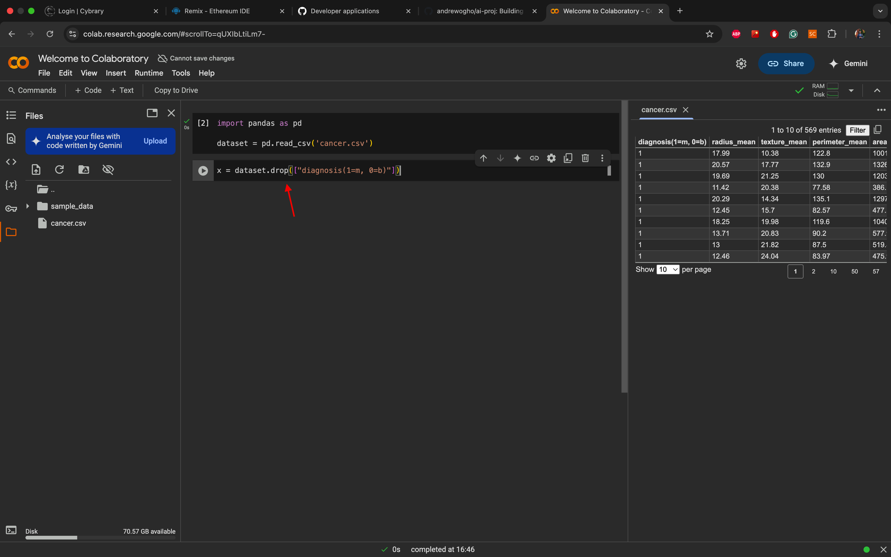

5. Add columns to x-axis:

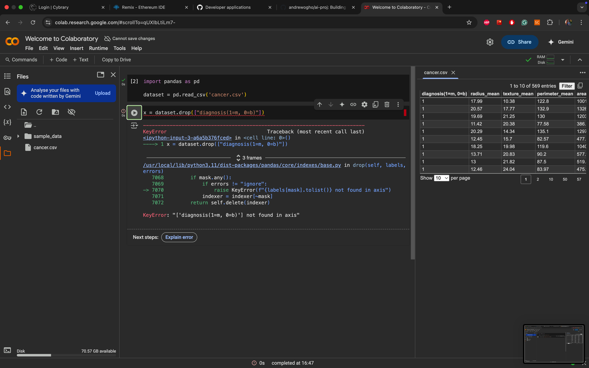
  - Code cell above failed when ran. because `columns` was missing. 
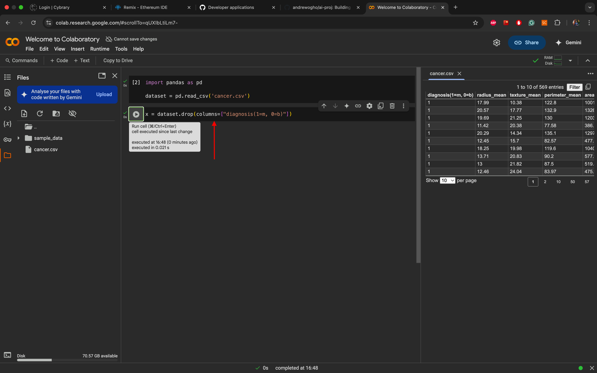

6. Add y-axis && sklearn:


- sklearn is used to train, test datasets and more.

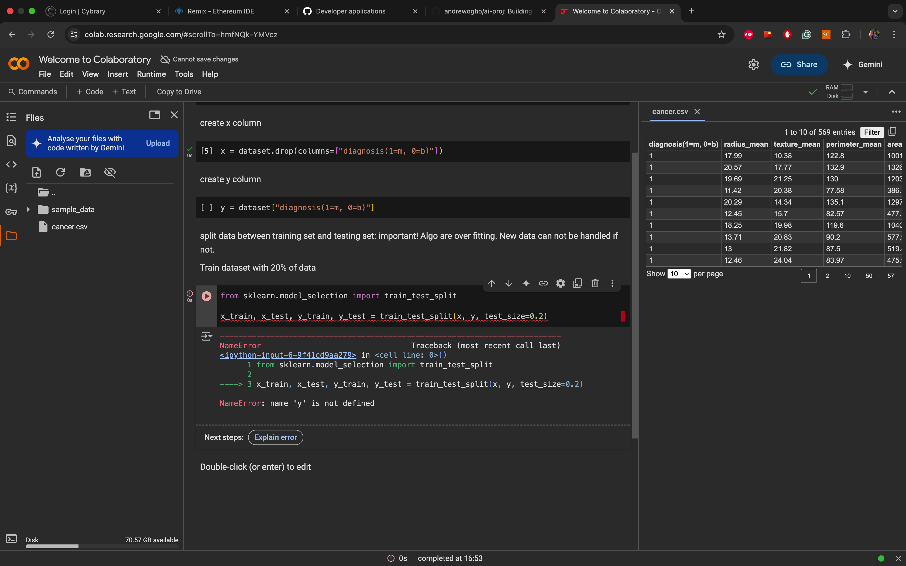

7. Sklearn code cell ran again after troubleshooting:

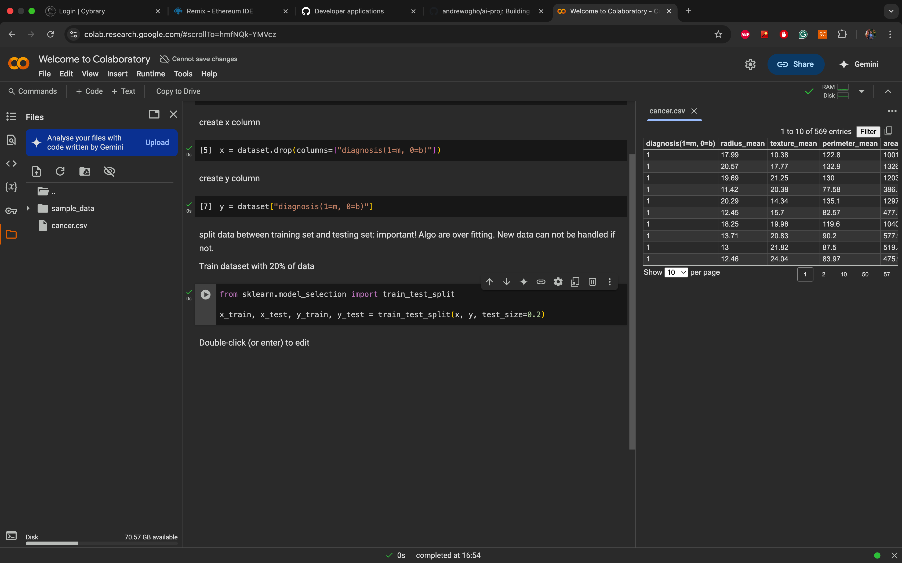

8. Add Tensorflow ai:

```
import Tensorflow as tf
```
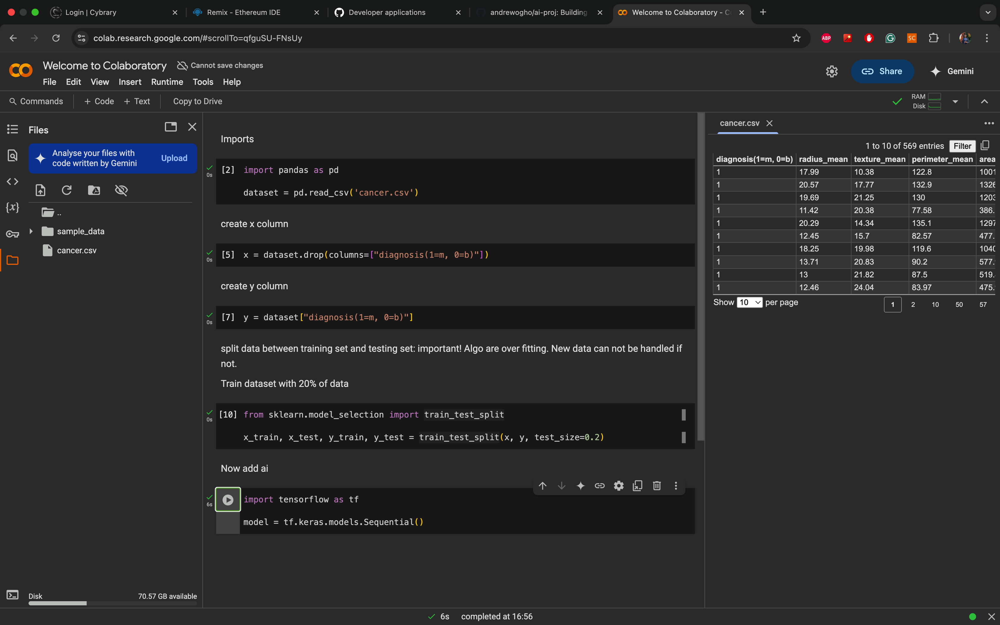


9. Add neurons: 

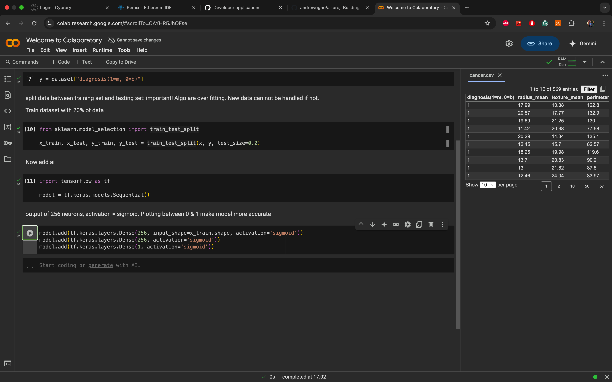

10. Compile && Fit model:

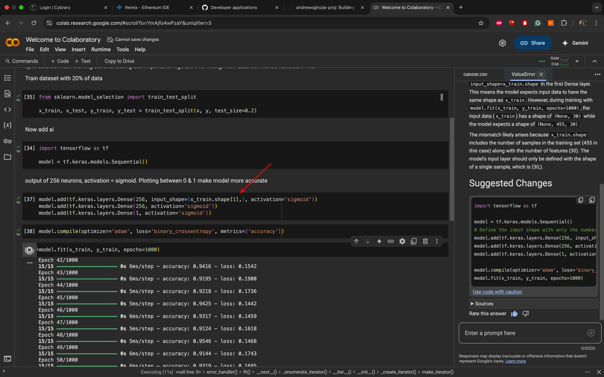

11. Run epochs:

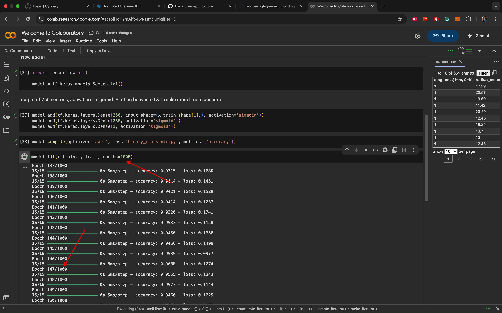

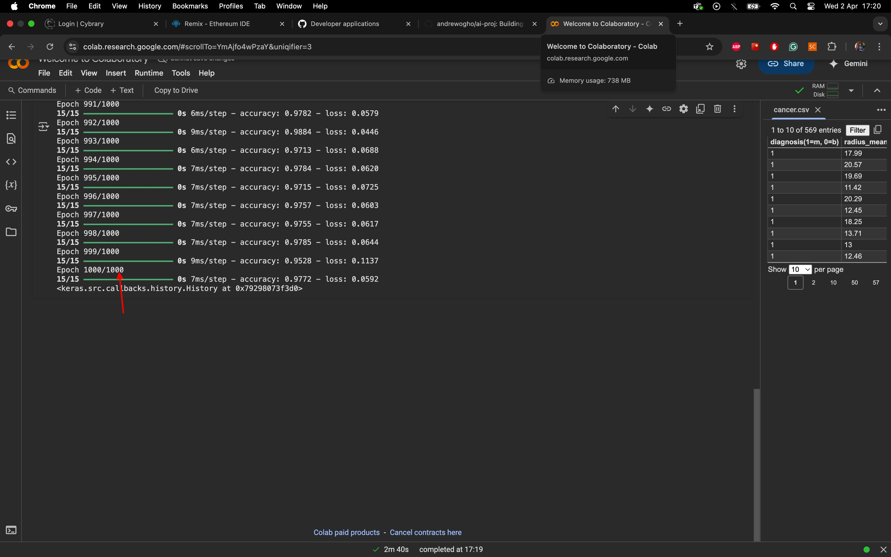

12. Evalute accuracy:

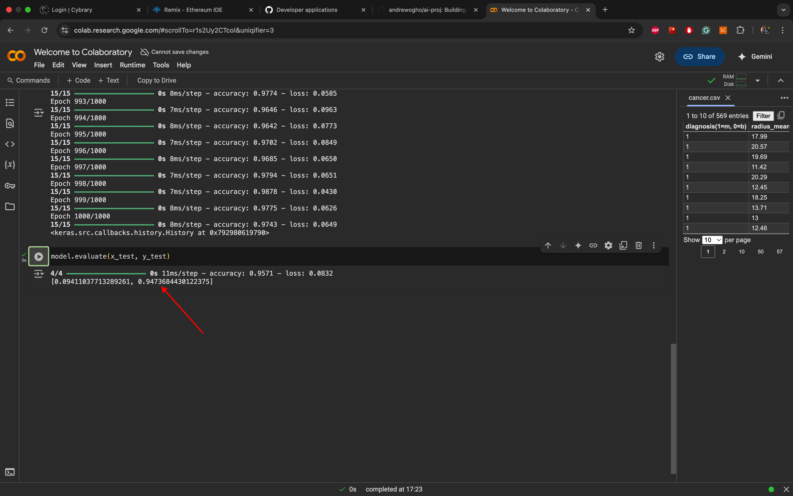


---
### Troubleshooting:

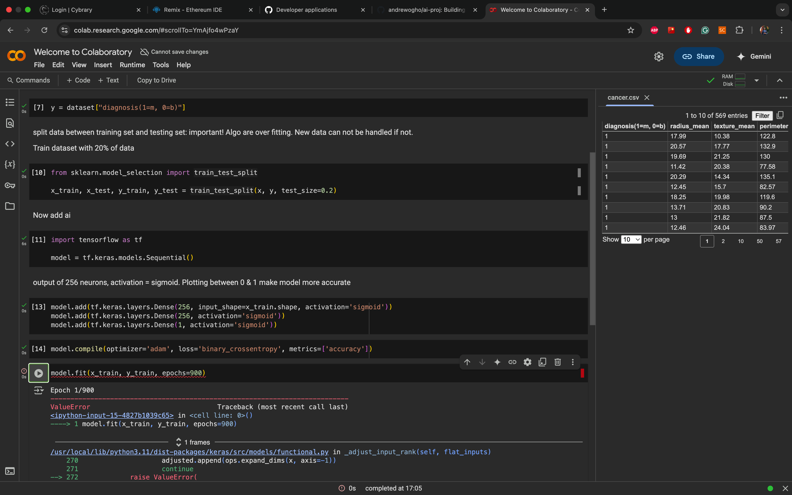

- To resolve error:


### CPU Resources:

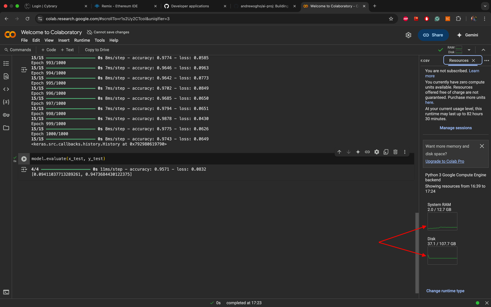
---